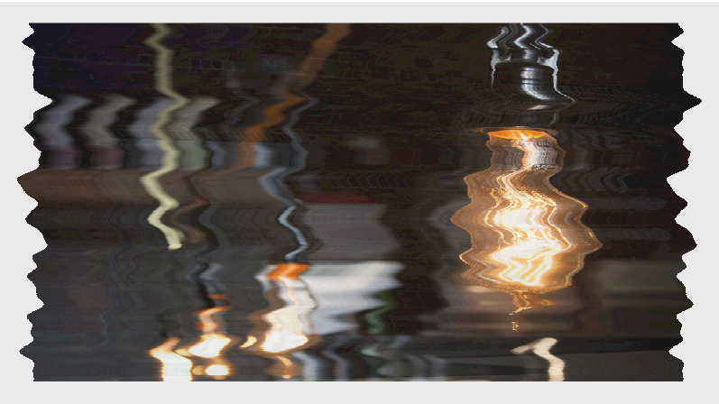

# vue-svg-distotion



<ul>
	<li><a href="http://yoshihitofujiwara.github.io/vue-svg-distotion/index.html" target="_blank">DEMO</a></li>
</ul>


___
## Usage

```
<template>
  <div id="app">
		<h1>vue-svg-distotion</h1>
		<p><a
			href="https://github.com/yoshihitofujiwara/vue-svg-distotion" target="_blank">
			<SvgDistotion class="svg"
				@mouseleave="onPassive"
				@mouseenter="onActive"
				ref="svg"
				:image="image"
				:filter="filter"
				:duration="duration"
				:ease="ease"
			/>
		</a></p>
  </div>
</template>

<script>
import SvgDistotion from './components/SvgDistotion.vue'

export default {
  name: 'app',

  components: {
    SvgDistotion
  },

	data(){
		return {
			image: {
				passive: "./assets/img/img01.jpg",
				active: "./assets/img/img02.jpg",
				width: "90%",
				height: "90%",
				x: "5%",
				y: "5%"
			},
			filter: {
				type: "fractalNoise",
				baseFrequencyX: 0.01,
				baseFrequencyY: 0.003,
				numOctaves: 2,
				seed: 2,
				stitchTiles: "noStitch",
				scale: 80,
				maxScale: 100
			},
			duration: 0.8,
			ease: "Power1.easeOut"
		}
	},

	methods: {
		onActive(){
			this.$refs.svg.onActive();
		},
		onPassive(){
			this.$refs.svg.onPassive();
		}
	}
}
</script>

<style>
.svg{
	width: 640px;
  height: 360px;
  cursor: pointer;
	background: #e9e9e9;
}
</style>
```

___
## Options

|name|type|default|description|
|----|----|----|----|
|image|Object| | |
|image.passive|String|undefined|<strong style="color:#f09">Required</strong> passive image path|
|image.active|String|undefined|<strong style="color:#f09">Required</strong> active image path|
|image.width|String or Number|90%| image width|
|image.height|String or Number|90%| image height|
|image.x|String or Number|5%| image offset x|
|image.y|String or Number|5%| image offset y|
|filter|Object| | see: <a href="https://developer.mozilla.org/en-US/docs/Web/SVG/Element/feTurbulence" target="_blank">feTurbulence</a> |
|filter.type|String|fractalNoise| Noise Type "fractalNoise" or  "turbulence"|
|filter.baseFrequencyX|Number|0.01| Noise Frequency X|
|filter.baseFrequencyY|Number|0.003| Noise Frequency Y|
|filter.numOctaves|Number|2| Noise numOctaves|
|filter.stitchTiles|String|noStitch| "noStitch" or "stitch"|
|filter.scale|Number|80| filter scale|
|duration|Number|0.8|Animation Duration (Sec)|
|ease|String, Object|Power2.easeOut|Animation Easing: <a href="https://greensock.com/docs/Easing" target="_blank">GreenSock Ease</a>|
|mouseenter|event| | emit mouseenter |
|mouseleave|event| | emit mouseleave |

___


## Project setup

yarn or npm

```
yarn install
```

### Compiles and hot-reloads for development
```
yarn run serve
```

### Compiles and minifies for production
```
yarn run build
```

### Run your tests
```
yarn run test
```

### Lints and fixes files
```
yarn run lint
```

### Customize configuration
See [Configuration Reference](https://cli.vuejs.org/config/).
